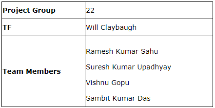

## Team

## Motivation

Today&apos;s world, most of the users listen to music online using several competing media services  like spotify, pandora, youtube, etc.. There is no dearth in choice of songs. However, listening to the same song repeatedly will create a stale experience. Acknowledging this fact, companies have been spending a lot of resources to enhancing users listening experience.  Users can extend their playlists, with recommended songs that they most likely matches their unique musical taste, introducing an element of novelty and excitement. This can increase user engagement and encourage continued subscription.

## Project Statement

Building a music recommendation system is a common task that is faced by many companies including, Spotify. One of it&apos;s primary products is Playlists, collection of tracks that individual users (or Spotify) can build for every mood or event. The underlying goal of the recommendation system is to personalize content and identify relevant playlist/song recommendation for our audiences. 
There are mostly 3 types of music recommendation systems: content-based, collaborative and popularity. We here will be focusing on building content-based recommendation system.

### Goal:Automatic Playlist Recommender
Create a model for song discovery on the basis of the base playlist, user/context/song features information that might be important to quality of a playlist. Some of user/context information might include intent, emotion, location, playlist, purpose(driving/road trip, studying, etc). Use the developed model(s) for automatic playlist recommendation.